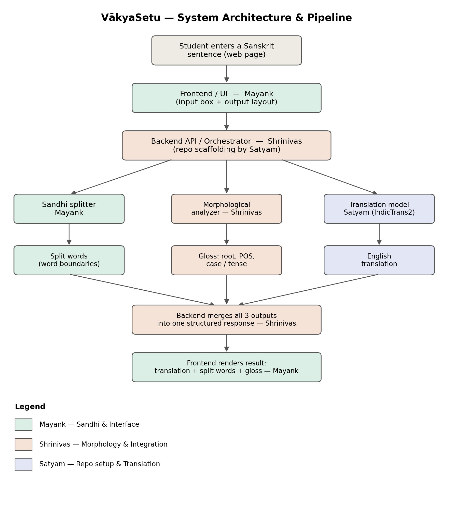

# VākyaSetu

A text-to-text Sanskrit learning assistant for school students (CBSE/NCERT, Classes 6–10).

Paste or type a Sanskrit prose sentence and get back:
1. An English translation
2. A sandhi-split breakdown (compound/fused words separated into components)
3. A simplified word-level grammatical gloss (case, gender, number, tense, root)

VākyaSetu is built by fine-tuning and integrating existing Sanskrit NLP tools rather than
building new foundational models — see [Scope & Limitations](#scope--limitations) below.

## Status

🚧 In active development. This README will be updated as modules are built.

## Team

| Member  | Owns |
|---|---|
| Satyam    | Repository setup, IndicTrans2 fine-tuning, translation module, data pipeline |
| Mayank    | Sandhi-splitting module, frontend/UI |
| Shrinivas | Morphological analysis module, backend orchestration & integration |

## Architecture



A student sentence is normalized once, then processed by two independent branches —
sandhi + morphology, and translation — which are merged into a single structured
response before rendering. See [`docs/architecture.md`](docs/architecture.md) for details.

## Tech stack

| Layer | Choice |
|---|---|
| Translation model | [IndicTrans2](https://github.com/AI4Bharat/IndicTrans2) (distilled 200M), fine-tuned with LoRA |
| Sandhi splitting | [sanskrit_parser](https://github.com/kmadathil/sanskrit_parser) (Sanskrit Heritage Reader lexicon) |
| Morphological analysis | [sanskrit_parser](https://github.com/kmadathil/sanskrit_parser) / [Sanskrit Heritage Reader](https://sanskrit.inria.fr) |
| Backend | FastAPI |
| Frontend | Streamlit (MVP) → React (production) |
| Storage | SQLite (optional caching only — no data leaves the machine) |

## Repository structure

```
vakyasetu/
├── backend/
│   └── app/
│       ├── api/          # FastAPI route definitions
│       ├── core/         # config, settings
│       ├── models/       # Pydantic request/response schemas
│       └── services/     # translation.py, sandhi.py, morphology.py wrappers
├── frontend/
│   ├── streamlit_app.py  # MVP UI (Phase 1)
│   └── web/              # React app (Phase 2)
├── ml/
│   ├── scripts/          # data download, cleaning, fine-tuning, evaluation
│   ├── notebooks/        # exploration notebooks
│   └── checkpoints/      # fine-tuned weights (git-ignored)
├── data/
│   ├── raw/               # original downloaded corpora
│   ├── interim/           # cleaned, normalized text
│   ├── processed/         # final train/val/test splits
│   └── ncert_gold/        # held-out NCERT benchmark — never used for training
└── docs/                  # architecture notes, evaluation reports
```

## Getting started

```bash
# Clone
git clone https://github.com/<your-username>/vakyasetu.git
cd vakyasetu

# Backend
cd backend
python3 -m venv venv
source venv/bin/activate          # Windows: venv\Scripts\activate
pip install -r requirements.txt

# Frontend (MVP)
cd ../frontend
pip install streamlit
streamlit run streamlit_app.py
```

Copy `.env.example` to `.env` and fill in any local paths or optional API keys before running.

## Scope & limitations

This project deliberately does **not** attempt:
- Speech input/output (text only)
- Full anvaya (formal word-order rearrangement)
- Perfect sandhi-splitting — this remains an open problem in Sanskrit NLP; the system
  surfaces confidence/ambiguity rather than silently guessing
- Classical/Vedic verse — the target domain is contemporary NCERT textbook prose

These boundaries are shown to the user in the interface, not hidden.

## License

TBD — add a LICENSE file once the team decides (MIT is a reasonable default for a
student project using open-source dependencies).
